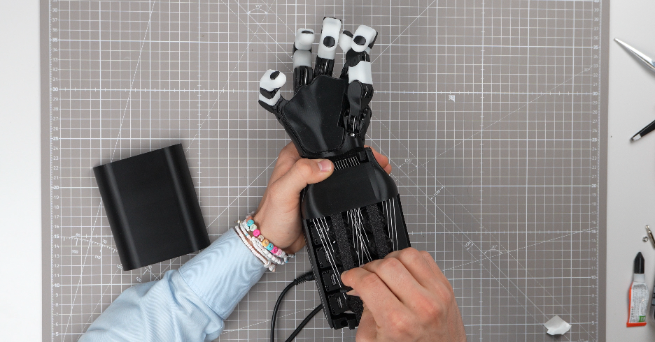

<p align="center">
  
</p>

<div align="center" style="line-height: 1;">
  <a href="https://arxiv.org/abs/2504.04259" target="_blank"></a>
  <a href="https://discord.gg/xvGyxaccRa" target="_blank"></a>
  <a href="https://x.com/orcahand" target="_blank"></a>
  <a href="https://orcahand.com" target="_blank"></a>
  <br>
  <a href="https://github.com/orcahand/orca_files" target="_blank"></a>
</div>

# ORCA Hand Files

CAD and print files for the ORCA robotic hand.

The ORCA Hand now supports both **Feetech** and **Dynamixel** servos. Every printable variant ships two ready-to-print plates — `*-FT.3mf` for Feetech and `*-DX.3mf` for Dynamixel — so you can build the hand around whichever actuators you have. STL sources are shared across both; only the motor-specific parts (forearm/wrist structures, adapters) differ between the FT and DX plates.

## Structure

```
orca_v2/                          # Current ORCA hand — shared base + variants
  base/                           # Canonical full hand
    Prints-1000-DX.3mf            # Dynamixel print plate
    Prints-1000-FT.3mf            # Feetech print plate
    Clips-Only.3mf
    01_Fingers/*.stl              # STL source files in subdirs
    02_Carpals/*.stl
    03_Wrist/*.stl
    04_ForeArm/*.stl
    05_Spools/*.stl
    07_Molds/*.stl
    ...
  touch/                          # Touch-sensor variant
    Prints-2000-DX.3mf            # Pulls base + touch STLs in one pass
    Prints-2000-FT.3mf
    01_Fingers/*-Touch.stl        # Override STLs only
    02_Carpals/*.stl
  lite/                           # Lite variant — STL sources (3MFs TBD)
    01_ForeArm/*.stl
    02_Spools/Lite-*.stl
  joint-sensing/                  # Joint-sensing variant — STL sources (3MFs TBD)
    01_Fingers/*JS*.stl

orca_v1/                         # V1 design (self-contained)
  Print_Files_Bambu/*.3mf         # Print files in dedicated subdir
  ORCA_Fingers/*.stl              # STLs in sibling dirs
  ORCA_Tower/*.stl
  ...
```

Variant 3MFs under `orca_v2/<variant>/` automatically resolve part names against the whole `orca_v2/` tree, so they pick up shared STLs from `orca_v2/base/` without duplication. Edit a base STL once and every variant 3MF that references it gets updated.

## Updating Print Files After STL Changes

```bash
# Find which 3MF(s) contain a given STL (cascades across variants)
python3 scripts/find_3mf_for_file.py orca_v2/base/05_Spools/BaseSpool.stl

# Update all parts in a 3MF from source STLs (variants pull base parts too)
python3 scripts/update_3mf.py orca_v2/touch/Prints-2000-DX.3mf --all

# Preview without writing
python3 scripts/update_3mf.py orca_v2/base/Prints-1000-DX.3mf --all --dry-run

# List parts inside a 3MF
python3 scripts/update_3mf.py orca_v2/base/Prints-1000-DX.3mf --list
```

## License

Copyright (c) 2026 ORCA Dexterity, Inc.

All files in this repository — hardware designs (CAD/STL/3MF) and source code —
are licensed under the [Creative Commons Attribution 4.0 International License
(CC BY 4.0)](LICENSE). You may share and adapt the material for any purpose,
including commercially, with appropriate credit. No patent or trademark rights
are granted.
