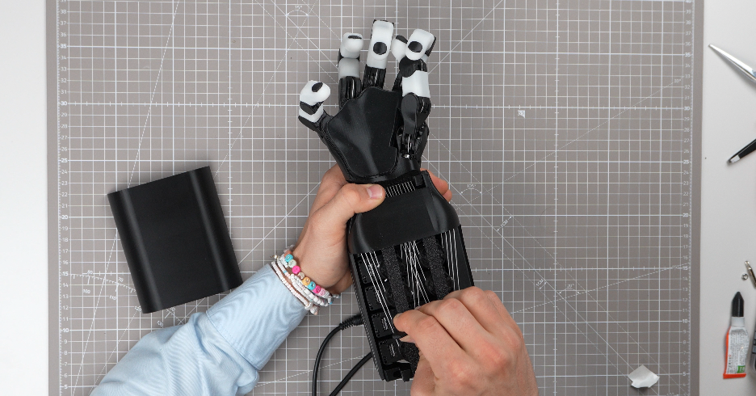

<p align="center">
  
</p>

<div align="center" style="line-height: 1;">
  <a href="https://arxiv.org/abs/2504.04259" target="_blank"></a>
  <a href="https://discord.gg/xvGyxaccRa" target="_blank"></a>
  <a href="https://x.com/orcahand" target="_blank"></a>
  <a href="https://orcahand.com" target="_blank"></a>
  <br>
  <a href="https://github.com/orcahand/orca_files" target="_blank"></a>
</div>

# ORCA Hand Files

CAD and print files for the ORCA robotic hand.

## Print Files

There are two hand variants. Each ships one print file for the hand itself and one for the silicone skin molds:

| Variant | Hand print file | Silicone mold file |
|---|---|---|
| **Base hand** | `orca_v2/base/Prints-1100.3mf` | `orca_v2/base/SiliconeMolds-1100.3mf` |
| **Touch hand** (touch sensors in the fingertips) | `orca_v2/touch/Prints-2100.3mf` | `orca_v2/touch/SiliconeMolds-2100.3mf` |

All files are Bambu Lab Studio projects with pre-arranged plates and print settings.

### Hand print files (`Prints-*.3mf`)

Everything you need to print the hand. The ORCA Hand supports both **Feetech** and **Dynamixel** servos: print plate 1 (`DYNAMIXEL`) *or* plate 2 (`FEETECH`) for the tower, depending on your actuators. Every other plate is the same for both.

The print files also include the **skin parts as direct TPU prints** — the finger skins and the carpal skin — on their own `(TPU)` plates. They are white in the base hand and black in the touch hand. Printing the skins in TPU is the quickest way to get a complete hand.

### Silicone mold files (`SiliconeMolds-*.3mf`)

Print these molds, then cast the skins in silicone. **We recommend silicone skins** — they grip better and last longer than TPU. If you want something quick and dirty, the TPU-printed skins from the hand print file work as well.

The mold files contain the finger skin molds with their clips, the carpal molds, and the funnels for pouring. One plate (`WITH TPU (~85A)`) prints the flexible carpal mold halves in soft TPU; everything else is PLA.

> **Note:** It is still unverified whether the TPU-printed carpal skin fits into the carpals as tightly as the silicone one. If it is loose, glue it in.

If you prefer compression molding over pouring, `orca_v2/base/07_Molds/Compression-Molds.3mf` contains the compression molds for the finger and carpal skins.

## Repository Structure

```
orca_v2/                          # Current ORCA hand — shared base + variants
  base/                           # Base hand
    Prints-1100.3mf               # Hand print file (Dynamixel + Feetech plates)
    SiliconeMolds-1100.3mf        # Silicone skin molds
    01_Fingers/*.stl              # STL sources
    02_Carpals/*.stl              #   (incl. *_Skin_TPU.stl carpal skins)
    03_Wrist/*.stl
    04_ForeArm/*.stl
    05_Spools/*.stl
    06_CNC/                       # CNC parts (STEP + drawings)
    07_Molds/*.stl                # Mold STLs
    07_Molds/Compression-Molds.3mf  # Compression molds (alternative to pouring)
    09_Skin/*.stl                 # Finger skin STLs (TPU)
    <section>/step_files/*.step   # STEP sources, named like the STL they belong to
    ASSEMBLY_ADDENDUM.md          # Assembly notes
    manual-part-a.pdf             # Assembly manual
  touch/                          # Touch-sensor variant
    Prints-2100.3mf               # Hand print file (Dynamixel + Feetech plates)
    SiliconeMolds-2100.3mf        # Silicone skin molds
    01_Fingers/*-Touch.stl        # Override STLs; everything else comes from base/
    02_Carpals/*-Touch.stl
  lite/                           # Lite variant — STL + STEP sources only
  joint-sensing/                  # Joint-sensing variant
    PrintsJointSensing.3mf

orca_v1/                          # V1 design (self-contained, legacy)
  Print_Files_Bambu/*.3mf
  ORCA_Fingers/*.stl
  ...
```

Variant 3MFs under `orca_v2/<variant>/` resolve part names against their own variant folder first, then `orca_v2/base/`, so they pick up shared STLs from base without duplication (a variant's own copy of a name wins over base). Edit a base STL once and every variant 3MF that references it gets updated.

## Updating Print Files After STL Changes

```bash
# Find which 3MF(s) contain a given STL (cascades across variants)
python3 scripts/find_3mf_for_file.py orca_v2/base/05_Spools/BaseSpool.stl

# Update all parts in a 3MF from source STLs (variants pull base parts too)
python3 scripts/update_3mf.py orca_v2/touch/Prints-2100.3mf --all

# Preview without writing
python3 scripts/update_3mf.py orca_v2/base/Prints-1100.3mf --all --dry-run

# List parts inside a 3MF
python3 scripts/update_3mf.py orca_v2/base/Prints-1100.3mf --list

# End-to-end: find changed STLs, update affected 3MFs, commit and push
python3 scripts/update-print-files.py --git
```

## License

Copyright (c) 2026 ORCA Dexterity, Inc.

All files in this repository — hardware designs (CAD/STL/3MF) and source code —
are licensed under the [Creative Commons Attribution 4.0 International License
(CC BY 4.0)](LICENSE). You may share and adapt the material for any purpose,
including commercially, with appropriate credit. No patent or trademark rights
are granted.
