# Addendum to the ORCA Hand V2 Assembly Tutorial

Due to the continuous development and improvement of the ORCA Hand, some new information is
currently missing from the [assembly tutorial video](https://www.youtube.com/watch?v=TgIz7HiyaoU).
This document lists these changes, as well as extra tips for easier assembly.

Timestamps below refer to that video.

**Important differences**

1. [PTFE tubes](#1-ptfe-tubes)
2. [Thumb AP pins](#2-thumb-ap-pins--timestamp-2104)
3. [Pins, gear and bearings for the carpals](#3-pins-gear-and-bearings-for-the-carpals--timestamp-3159)
4. [Spools](#4-spools--timestamp-5330)

**Tips**

5. [Inserting a PTFE tube which doesn't want to go in](#5-inserting-a-ptfe-tube-which-doesnt-want-to-go-in)
6. [Adding the PTFE tube over the M4 screws of the tower](#6-adding-the-ptfe-tube-over-the-m4-screws-of-the-tower--timestamp-3950)

---

## 1) PTFE tubes

PTFE tubes are added in some positions to reduce friction and wear.

### AP of each finger — timestamp 7:50

Each AP needs two PTFE tubes: one into each hole of the **wide** hole pair (highlighted in red).
Trim them so that they extend ~1 mm out on both sides (8–10 mm of PTFE tube is about the right length).

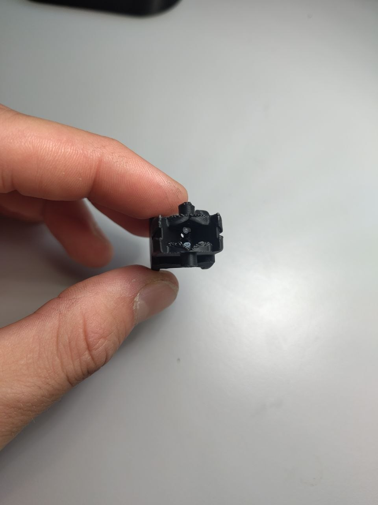
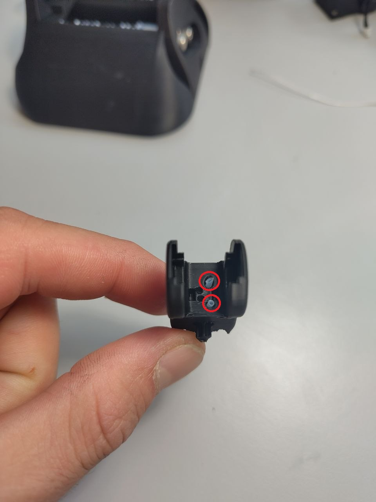

### Carpals — timestamp 25:05

Insert a PTFE tube into each of the 32 channels of the carpals. Trim so that they extend ~1 mm out
on both sides.

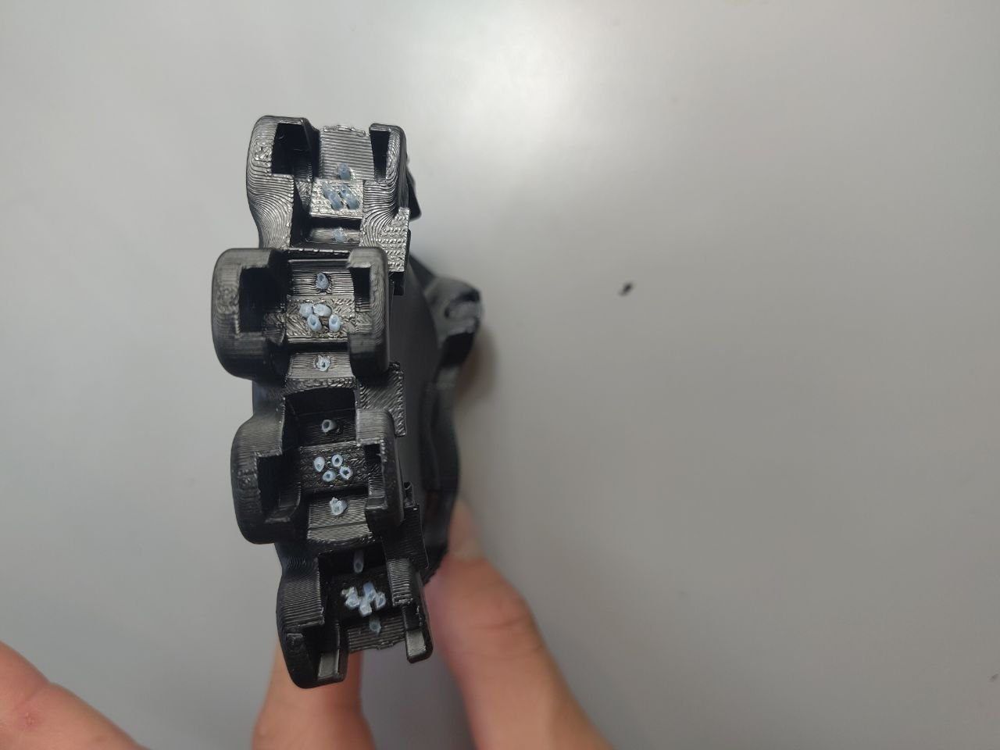
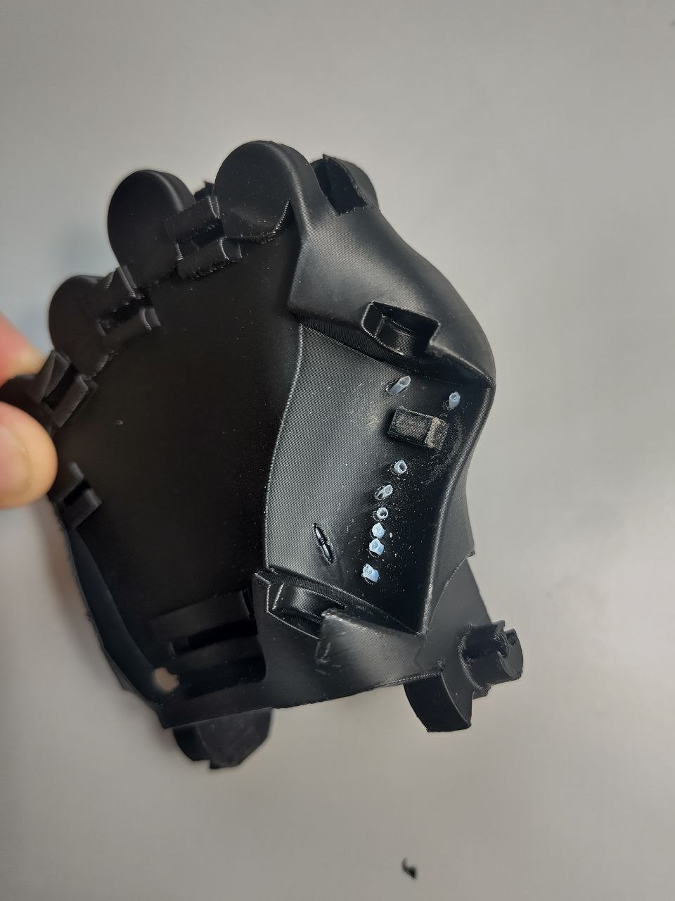
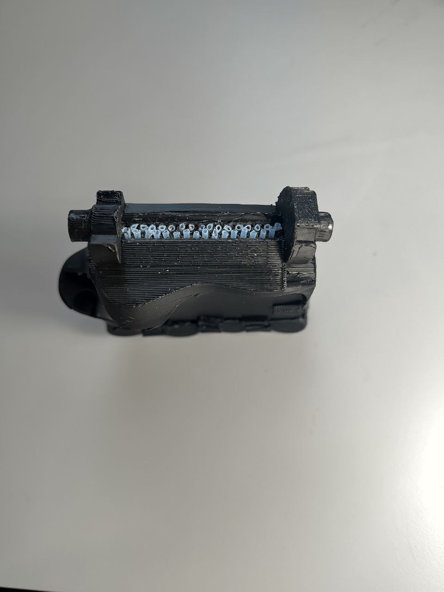

### Tower — timestamp 40:50

Insert a PTFE tube in each of the 32 channels of the tower. Trim them so that they extend ~1 mm out
on both sides.

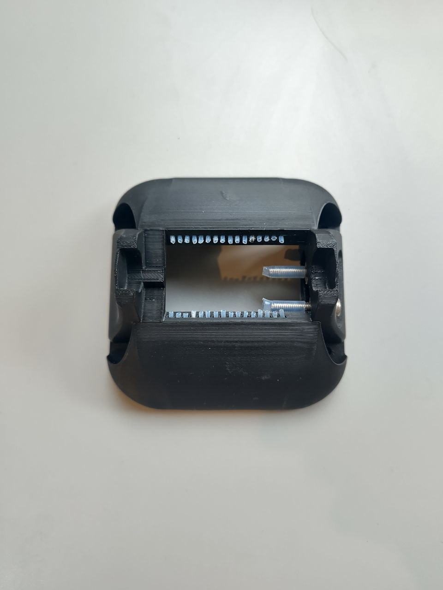
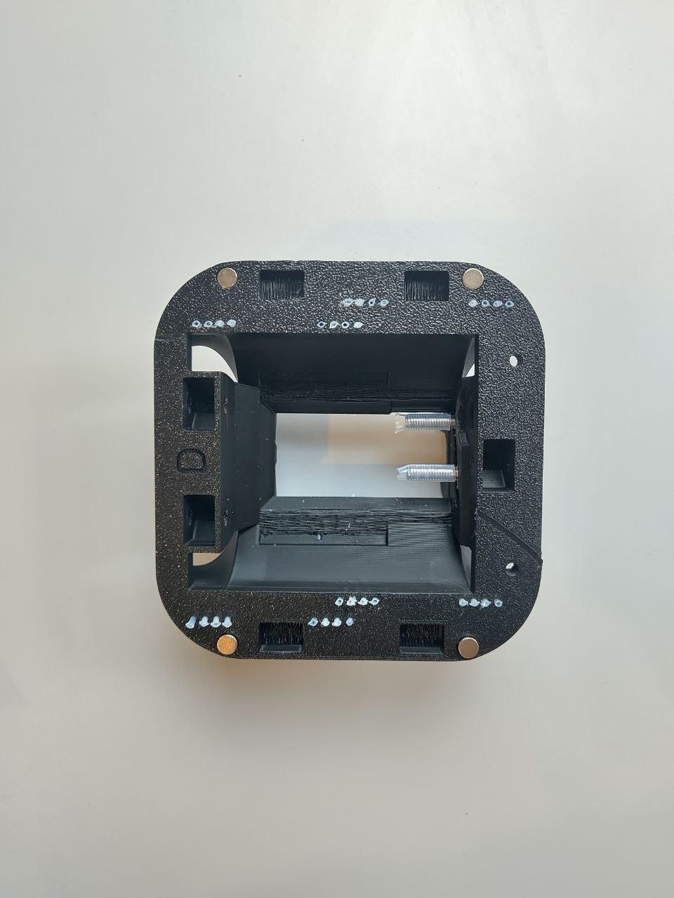

## 2) Thumb AP pins — timestamp 21:04

The video shows an outdated part. The new version of the thumb AP doesn't have 6 individual holes
but one long slit. First route all tendons through the slit, maintaining the same order as presented
in the video to prevent tendons crossing. Then insert two 2×30 pins in their respective slots
(highlighted in red). Finally add the 4×8×3 bearings as shown in the video.

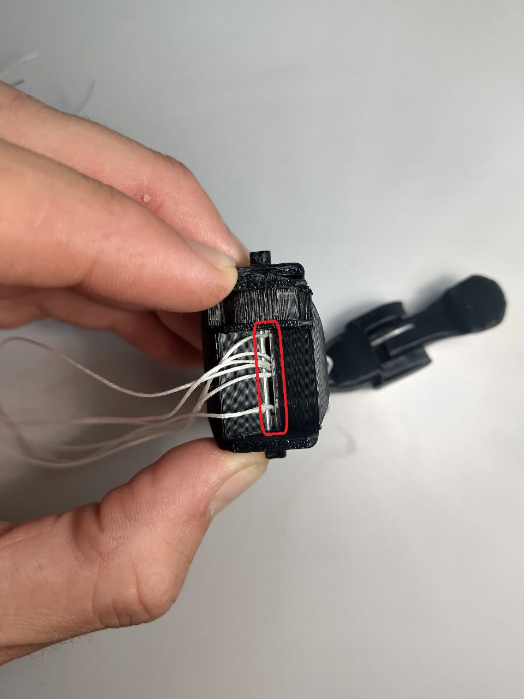
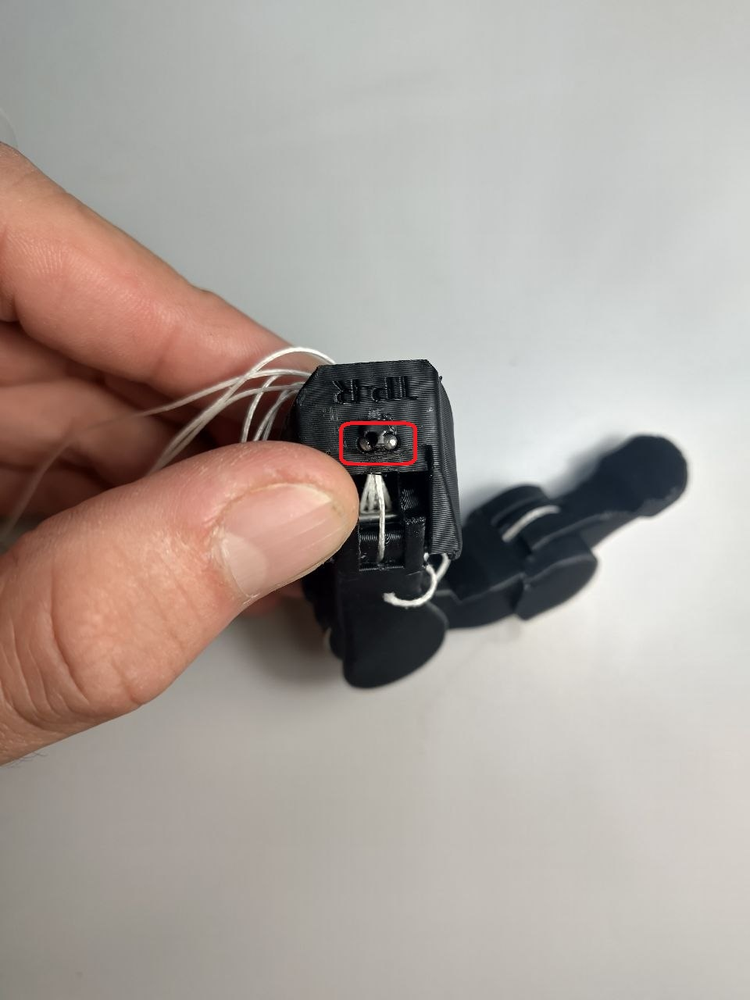

## 3) Pins, gear and bearings for the carpals — timestamp 31:59

> This step is missing from the video.

After routing all tendons through the carpals and assembling all 5 fingers to the carpals, add two
3×50 pins at the wrist joint (3×45 also work, but barely).

Then mount the 3D printed gear for the carpals (highlighted in green), and mount two 8×13×4 bearings
(highlighted in red) on each end of the carpals' shaft.

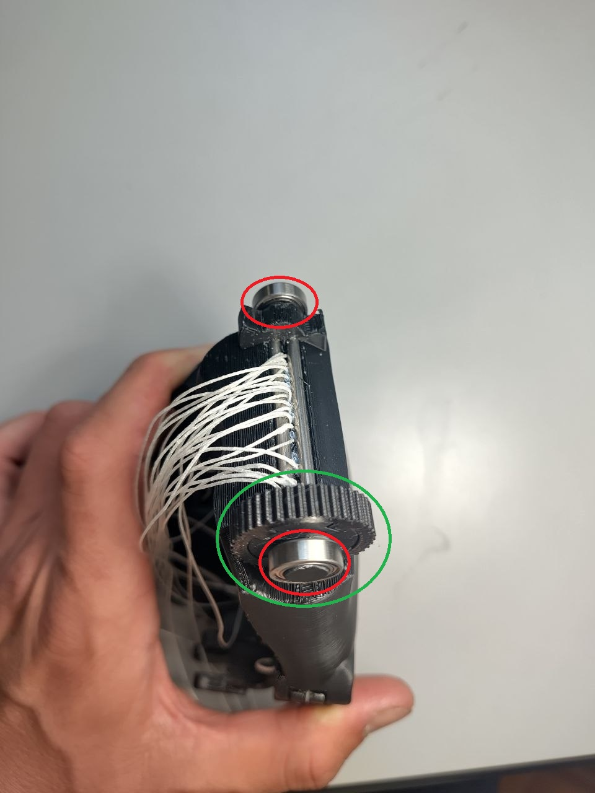

## 4) Spools — timestamp 53:30

The spools of the V1100 have slightly different dimensions from the V1000. You can easily tell them
apart: the V1100 spools have **4** holes for the screws instead of **5**.

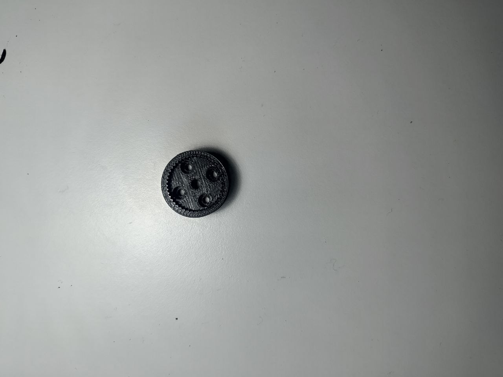
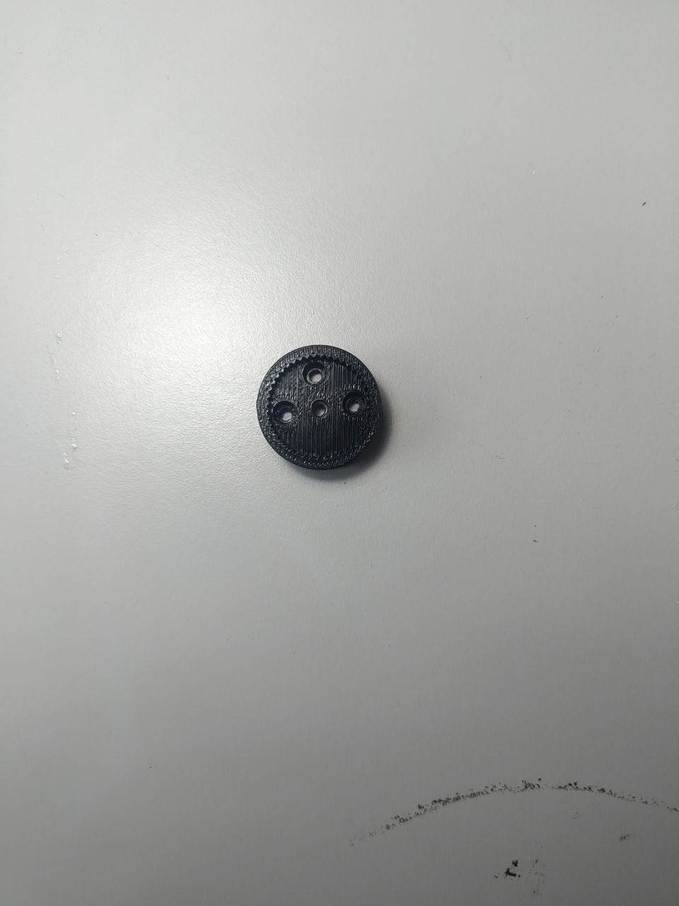

*Left: V1100 spool. Right: V1000 spool.*

---

## Tips

## 5) Inserting a PTFE tube which doesn't want to go in

It can be challenging to insert tubes into some particularly tight holes or long, winding channels.
One trick that helps is to prepare a tendon with a knot on one end and thread it through the PTFE
tube (step A). Then thread the tendon through the channel (step B) and use it to pull the PTFE tube
into the channel from the other end (step C), instead of trying to push it in.

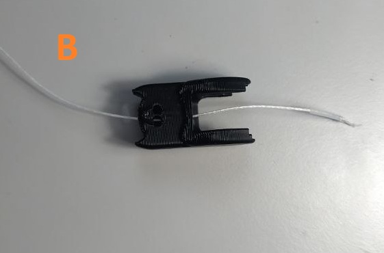
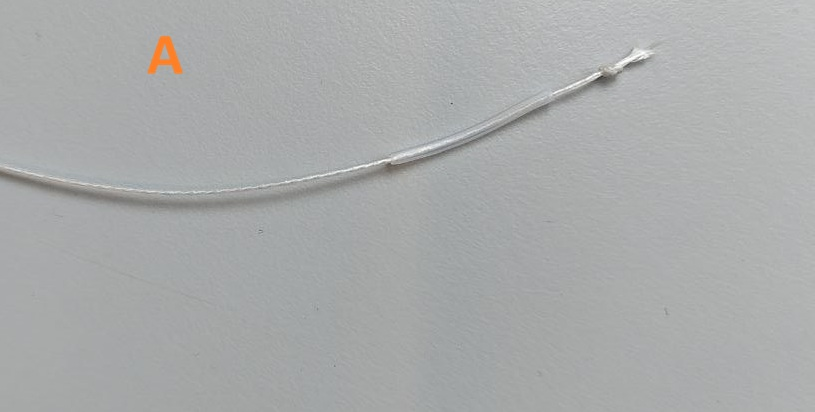
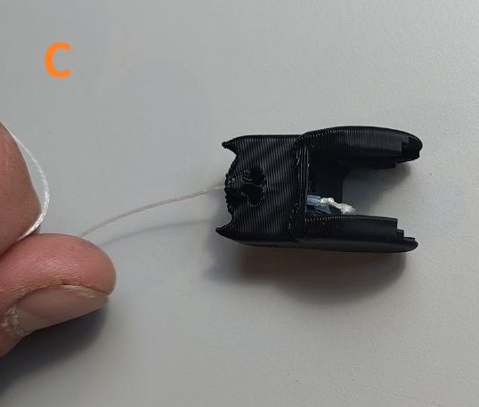

## 6) Adding the PTFE tube over the M4 screws of the tower — timestamp 39:50

If the PTFE tube used to cover the M4 screws is difficult to squeeze on, hold the tube tightly
pressed on the screw with one hand and use a screwdriver to screw it into the PTFE tube.

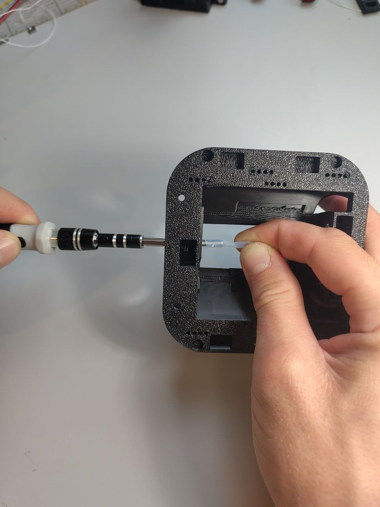
